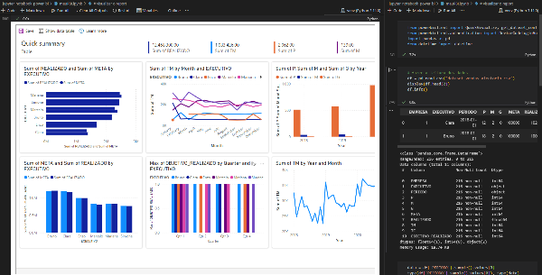

# **Power BI e Jupyter Notebook**

### Incorporando um componente Power BI em um Jupyter Notebook
#### Embedding a Power BI component in a Jupyter Notebook
 

## 🚀 Exemplos
* 01 - Incorporando Power BI, a partir de dados do Pandas.
* 02 - Incorporando Power BI, a partir de um relatório já existente.

⌨️ Por [Italo Costa](https://github.com/italomarcelogit) 😊